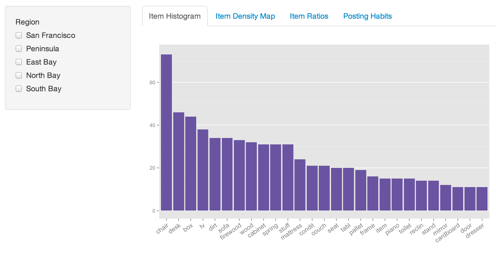
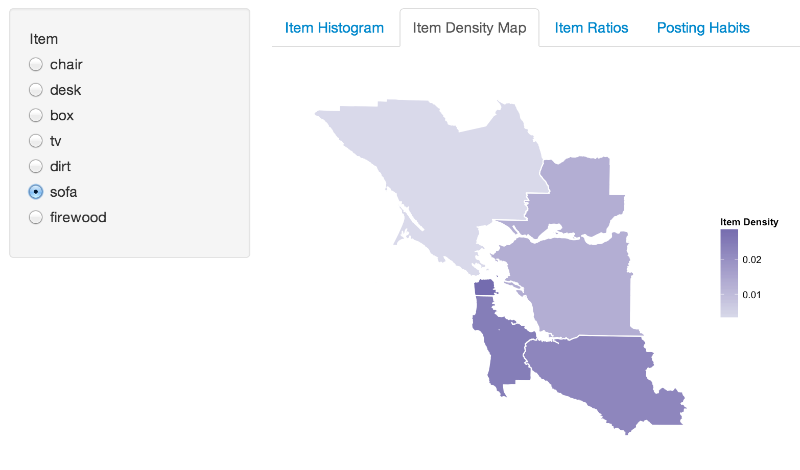
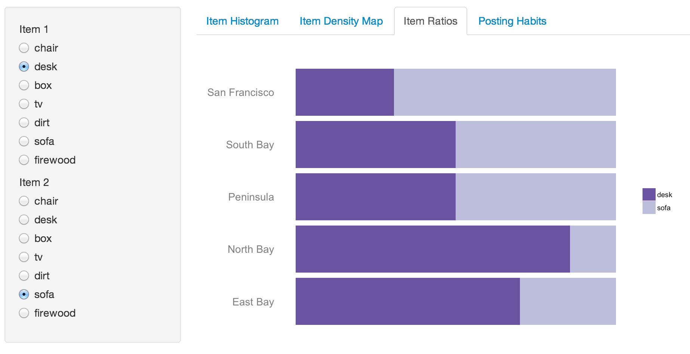
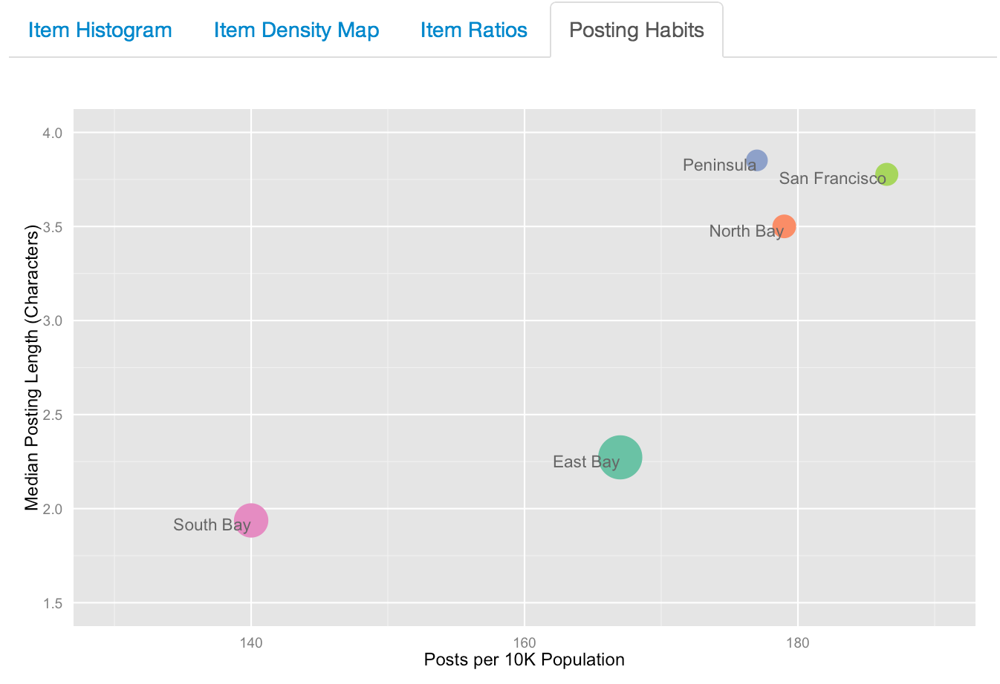

Final Project
==============================

| **Name**  | Ashley Cox |
|----------:|:-------------|
| **Email** | amcox@dons.usfca.edu |

## Dataset ##
For my final project, I scraped craigslist Free postings in an attempt to find some regional differences in the San Francisco Bay Area. In addition to the scraped text, I used population from the U.S. Census Bureau and open source shapefiles (for the map visualization).

## Techniques ##

### Item Histogram ###

&nbsp;&nbsp;&nbsp;&nbsp;&nbsp;&nbsp;This visualization is the most basic and meant to give a good overall picture of craigslist Free postings and the items they contain. I extracted "items" from the posting titles by using a part-of-speech tagger in Python and determining that, typically, the item was the last-occurring noun. The resulting items list is thus imperfect but arguably the most accurate one to result from automated extraction. 

&nbsp;&nbsp;&nbsp;&nbsp;&nbsp;&nbsp;To get items frequencies, I stemmed the "item" column of my dataset and counted frequencies for each region and overall. The user can choose any number of regions to view on the histogram at a time. I thought it was important for comparison that the order of items on the x-axis of my plot stay constant, even while different regions were selected, so I ordered item frequency according to the overall frequency. The histogram quickly and easily shows the user what sorts of items are most commonly seen on craigslist Free, so I think it is quite effective as a first visualization for this project. Because the frequencies are not scaled by number of posts per region, it shows the location of items that a user might be interested in, rather than showing a relative density (which is shown in the choropleth map).

&nbsp;&nbsp;&nbsp;&nbsp;&nbsp;&nbsp;I believe this plot has a good data-to-ink ratio, because, as is the case with most of my plots, I tend to prefer simple, clean plots with only a few ways to interact. The data density is somewhat lower as it visualizes only a few numbers (one for each item). However, the data that was cleaned to obtain those numbers was considerably dense. The lie factor on this plot is low, but could be improved by collecting scraped data over a longer period of time (at this point, it only visualizes one day's worth of posts).

### Item Density Map ###

&nbsp;&nbsp;&nbsp;&nbsp;&nbsp;&nbsp;The Item Density map is probably the most visually interesting of my plots. To create this choropleth map, I used open-source Bay Area county shapefiles and merged some counties to create the regions used by craigslist: North Bay, East Bay, San Francisco, Peninsula, and South Bay. I hard-coded columns in a new dataset for the top 7 most frequent items, where the value reflected the relative frequency of that item versus all other items in a particular region. As a result, the plot shows density within each region (as opposed to density among all regions), which I believe is the best and most accurate representation of item density. 

&nbsp;&nbsp;&nbsp;&nbsp;&nbsp;&nbsp;This plot's strength is in comparison. Rather than showing the overall number of certain items in different regions, it displays something more of a trend. Coupled with the fact that the information is in map format, the focus is shifted from being about items (as it is in the histogram) to being about regions. The item, in this plot, is a device used to show some differences among regions. For example, we can see that there is no free dirt in San Francisco, whereas there is plenty in the more rural craigslist regions. 

&nbsp;&nbsp;&nbsp;&nbsp;&nbsp;&nbsp;The data density and data-to-ink ratio are similar in this plot to the histogram. While the data frame used to produce the plot is very simple, with few rows and columns, the data that was reduced to create it was quite large. The data-to-ink ratio is quite high, as the plot shows little other than the map areas, colored by frequency. The lie factor is low, especially with the inclusion of the annotation regarding the density calculation.

&nbsp;&nbsp;&nbsp;&nbsp;&nbsp;&nbsp;I was able to create this map visualization using geom_polygon in ggplot2. It wasn't important for this application to show any geographic features; just showing the recognizable shapes of different regions of the Bay Area was sufficient. I did remove all axis labels, gridlines and the background panel to make it look less like a plot, and more like a simple map.

### Item Ratios ###

&nbsp;&nbsp;&nbsp;&nbsp;&nbsp;&nbsp;This plot is a type of re-worked stacked line graph. The point of this plot is to allow the user to, again, compare across regions, but now that comparison is done using two items instead of one (as in the choropleth map). This was created using the same dataframe as the first plot, but melted to allow for the stackedness. 

&nbsp;&nbsp;&nbsp;&nbsp;&nbsp;&nbsp;The data density is arguably higher in this plot than the other two, as it incorporates two items' frequencies into a single small-area plot. The data-to-ink ratio, again, is fairly high, as the cleanliness of the plot removes so many unnecessary visual elements. The lie factor is fine: no lies here.

&nbsp;&nbsp;&nbsp;&nbsp;&nbsp;&nbsp;For this plot, as well, I made heavy style changes, to the point where it doesn't look like a typical stacked line graph. I rotated the x and y axes so that region could be easily listed to the left; removed all axis and gridlines; and removed the background panel. The focus now lies entirely on the ratios.

### Posting Habits ###

&nbsp;&nbsp;&nbsp;&nbsp;&nbsp;&nbsp;This plot is somewhat of a departure from the others. As I had a completely text-based dataset, and the types of techniques that represent text are limited, I attempted to encode my data into something more numeric. On the x-axis, I show the number of posts for every 10,000 people (using population data from the Census Bureau). On the y-axis, I show posting length. Points are sized by overall population. This plot shows the tradeoff between posting volume and posting wordiness, and I think it has an interesting result. Posting volume is low for the South Bay, and high for San Francisco (as might be expected). While the general trend is for posting length to increase with posting volume, the East Bay stands out as somewhat of an outlier: it has relatively high posting volume but show posting lengths. 

&nbsp;&nbsp;&nbsp;&nbsp;&nbsp;&nbsp;A lie factor may come in to play somewhat in this plot since the data comes from just one day. It would be more accurate and interesting if the data had been collected more rigorously, over several weeks. However, despite this limitation, there is little else that misrepresents the data. The data density and data-to-ink ratio are low for this plot, but it is acceptable because the sparse points show some stark differences in the data points. 

&nbsp;&nbsp;&nbsp;&nbsp;&nbsp;&nbsp;Ideally, I would have shown this data with greater geographic granularity (each region in craiglist further breaks down into another geographic category). However, getting population data for that level of granularity proved too difficult. In the East Bay, for instance, some members of this category are neighborhoods within Oakland, while others are a combination of multiple towns (Fairfield/Vacaville, for instance). Mostly, the challenging part was finding population data at the neighborhood level: I could find data for individual streets, but elected not to spend the painstaking hours joining all those streets into neighborhoods. Not only would it have taken a long time, it most likely would have been inaccurate due to a high margin for human (my) error. So, the plot is somewhat sparse, but achieves its goal nonetheless.

## Interactivity ##

## Prototype Feedback ##

## Challenges ##