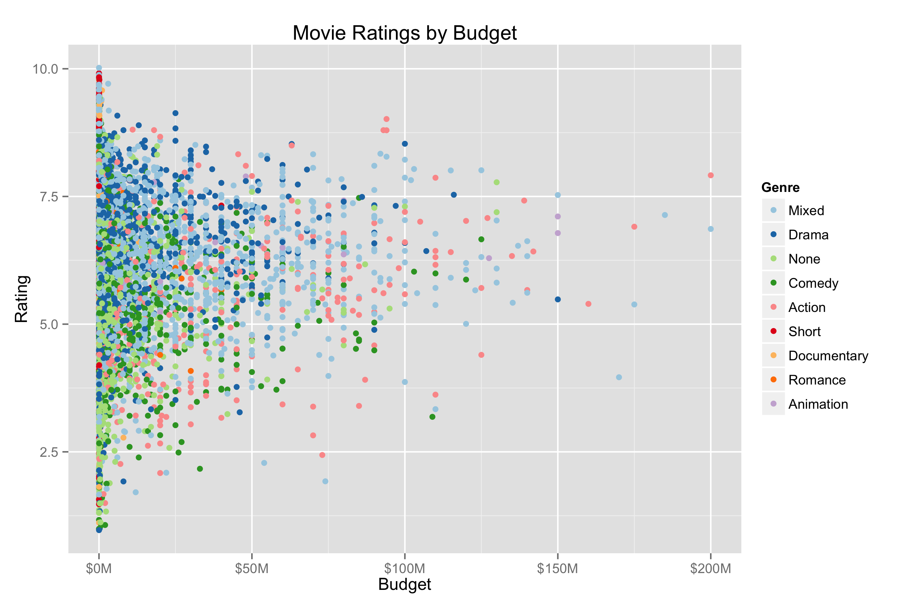

Homework 1: Basic Charts
========================

| **Name**  | Ashley Cox |
|----------:|:-------------|
| **Email** | amcox@dons.usfca.edu |

## Instructions ##

Run R code.

## Discussion ##

For this plot, I thought it'd be interesting to break the points out by genre. It allows the chart to be a little more meaningful, though for true comparison among genres the small multiples plot is easier to understand. I formatted the x-axis labels with dollar signs and fewer zeros. This happy combination of colors comes from ColorBrewer, and is featured in all my "movies" plots for continuity.

I first re-ordered the bars for this plot so that most frequent genres were shown first. I removed axis labels, x-axis tick marks, and x-gridlines because they were unnecessary. The resulting graph is cleaner and less distracting than the out-of-the-box plot.

In this plot, I used the same million dollar format I specified for the first plot. Additionally, I rotated the x-axis labels since it makes better use of the limited space for this small multiples plot. I left x- and y-axis labels in this case because they facilitate quick understanding of this crowded-looking graph.

This plot's color scheme, also from ColorBrewer, seemed appropriate for stock prices. I moved the legend from the side of the graph to the unused space within the graph to save space. I removed the y-axis label because it was redundant, but left the x-axis label for extra clarity. 