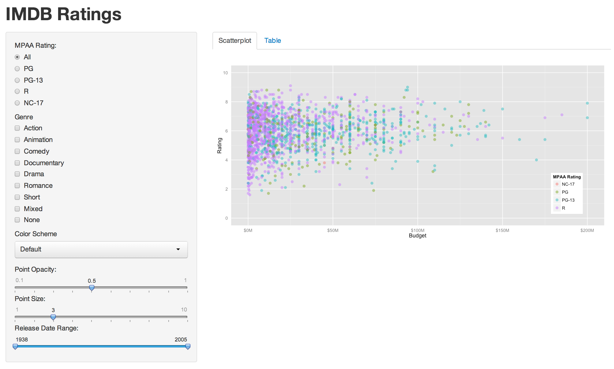

Homework 2: Interactivity
==============================

| **Name**  | [YOUR NAME]  |
|----------:|:-------------|
| **Email** | [USERNAME]@dons.usfca.edu |

## Instructions ##

The following packages must be installed prior to running this code:

- `ggplot2`
- `shiny`
- `scales`

To run this code, please enter the following commands in R:

```
library(shiny)
shiny::runGitHub('msan622', 'ashleycoxley', 'homework2')
```

This will start the `shiny` app. See below for details on how to interact with the visualization.

## Discussion ##



My `shiny` app allows users to view a scatterplot of IMDB movies' budget against rating. Users can select an MPAA rating through radio buttons and a number of different genres through checkboxes. The color scheme is customizable, as well, along with the point size and opacity. 

Some extra features I added to the app were a slider to select the movie release date, and a basic table so that users can see the background information generating the plots. Aesthetically, I removed the axis tick marks and re-formatted the x-axis values to make the plot appear cleaner. Otherwise, I was happy with the default settings for this plot.