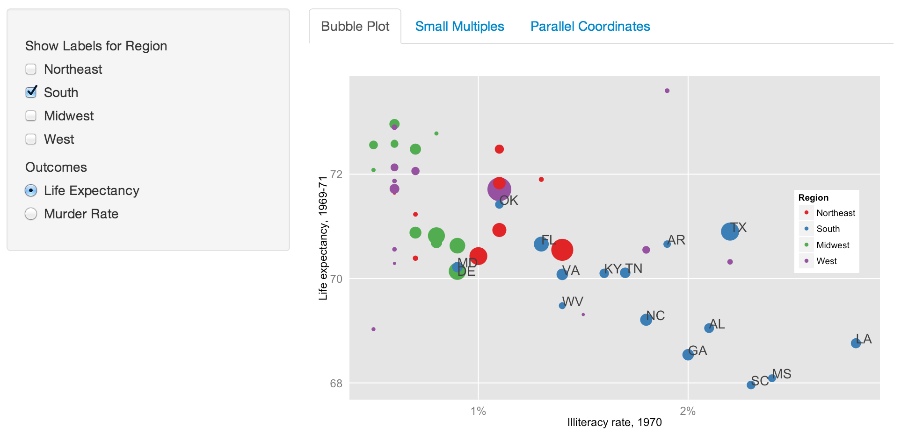
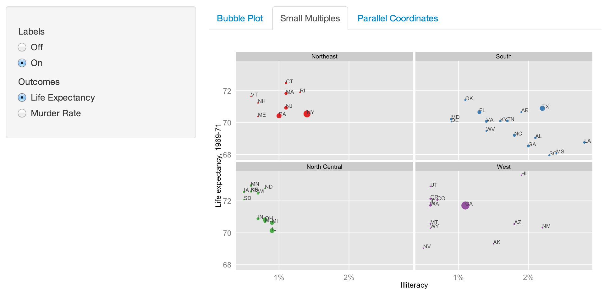
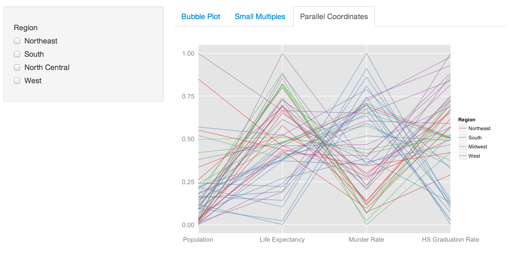

Homework [3]: Multivariate
==============================

| **Name**  | Ashley Cox  |
|----------:|:-------------|
| **Email** | amcox@dons.usfca.edu |

## Instructions ##

The following packages must be installed prior to running this code:

- `ggplot2`
- `shiny`
- `scales`
- `GGally`

To run this code, please enter the following commands in R:
```
library(shiny)
library(scales) 
library(ggplot2)
library(GGally)
shiny::runGitHub('msan622', 'ashleycoxley', subdir = 'homework3')
```

## Discussion ##

For this set of visualizations about US economic data, I wanted to balance interactivity with a clean set of controls and a clear message. Interactivity increases engagement and allows the user to focus on chosen aspects of the data, but too many options can be overwhelming.

I chose to highlight the way illiteracy is correlated with murder and life expectancy with my first two plots (bubble plot and small multiples), and the interplay between those and two more variables in my parallel coordinates plot. With brushing and filtering, I highlight the differences between different US regions. See notes on individual plots below.

### Bubble Plot ###

+ Plot shows illiteracy rate on the X-axis, and either murder rate or life expectancy on the Y-axis. Points are colored by region and sized by population.
+ Used brushing to allow the user to highlight different regions. When a region is chosen, its states are labeled with their name abbreviation. Multiple regions may be highlighted at once. At the moment, some labels are on top of each other; I can't seem to correct this. They are mostly easy to see.
+ Enlarged bubble size (of all size levels) to enable easier viewing.
+ Removed size legend, since actual population measurements not necessary. Replaced it with a note explaining size.

### Small Multiples Plot ###

+ Shows similar options as the main bubble plot, but regions are broken out for an easier view. I consider this plot to be brushing when paired with the bubble plot: it gives a closer look at the regional patterns in the data.
+ State labels can be toggled on and off.

### Parallel Coordinates Plot ###

+ Shows differences in population, life expectancy, murder rate, and high school graduation rate. Lines are colored by region as in the other plots.
+ Added another brushing technique in which the user can select a region to highlight.
+ Formatted the plot to stretch the lines from far left to far right on the plot (removed edge cushion space).

Some design changes across all graphs:
+ Created conditional interactivity panels so that choices were relevant for each plot. A drawback of this strategy is that chosen options that are the same across plots are not saved as the user switches from tab to tab. I'm not aware of a way to have some options remain constant across some, but not all, tabs.
+ Removed minor gridlines.
+ Formatted axis labels with percentages where applicable.
+ Removed axis tick marks.
+ Created conditional Y-axis labels where applicable.
+ Enlarged axis labels for easier viewing.