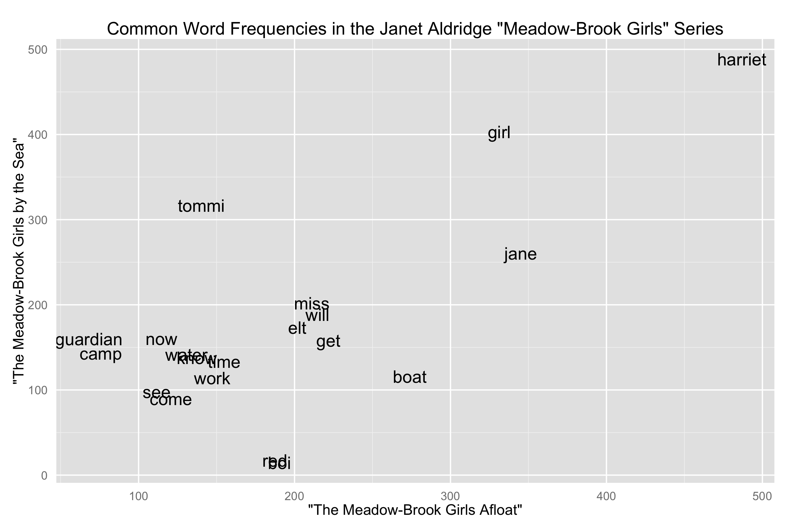
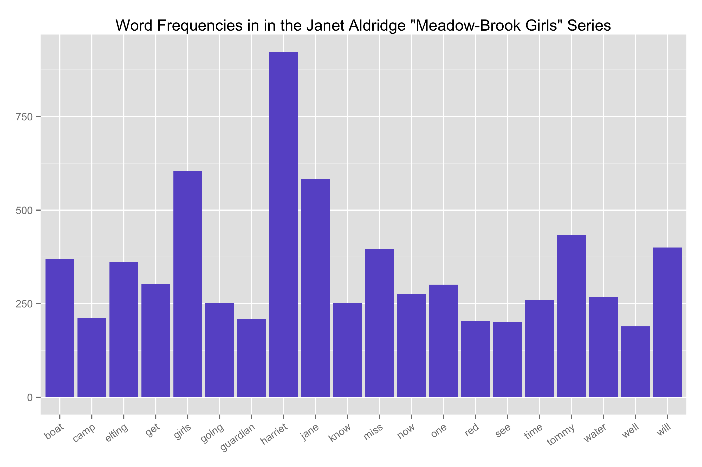

Homework 4: Text Visualization
==============================

| **Name**  | Ashley Cox  |
|----------:|:-------------|
| **Email** | amcox@dons.usfca.edu |

## Instructions ##

The following packages must be installed prior to running this code:

- `ggplot2`
- `tm`
- `wordcloud`

## Discussion ##

For this assignment, I chose to use two books from a 1920's children's series by Janet Aldridge. I was interested in older literature for young women so I thought visualizing these books might be a good way to explore it. 

To clean the data, I used the `tm` package to lower-case all the words, remove punctuation (while preserving the dashes in hyphenated words), remove stopwords (and additionally the word "dont"), and strip whitespace. I stemmed words using a Porter Stemmer for the relative frequency plot, but not the word cloud (since it is more aesthetic than information-rich and benefits from having full words). 

### Relative Frequency Plot ###

In this plot, we visualize the difference between relative frequencies of words in the two Aldridge texts I chose. I made some aesthetic changes with axis labels and tick marks, but otherwise the standard options looked appealing. 

### Word Cloud ###

This word cloud visualizes the most common words in both books. The font size corresponds to word frequency, so that the largest words are the ones seen most frequently. While it is less easy to accurately compare word frequencies, it does give a good big-picture overview of the words used in the books. While there is no real lie factor at play here (the font sizes capture frequency), the difficulty in distinguishing relative sizes makes this graph essentially have somewhat of a large lie factor. In regard to showing us something about the books: compared to current children's books, the words seem plain.

### Bar Plot ###

This plot visualizes the same information as the word cloud, but displays it in a more mathematically rigorous way. For this plot I rotated the x-axis labels to make them easily viewable, removed unnecessary axis labels, tick marks, and vertical gridlines.

