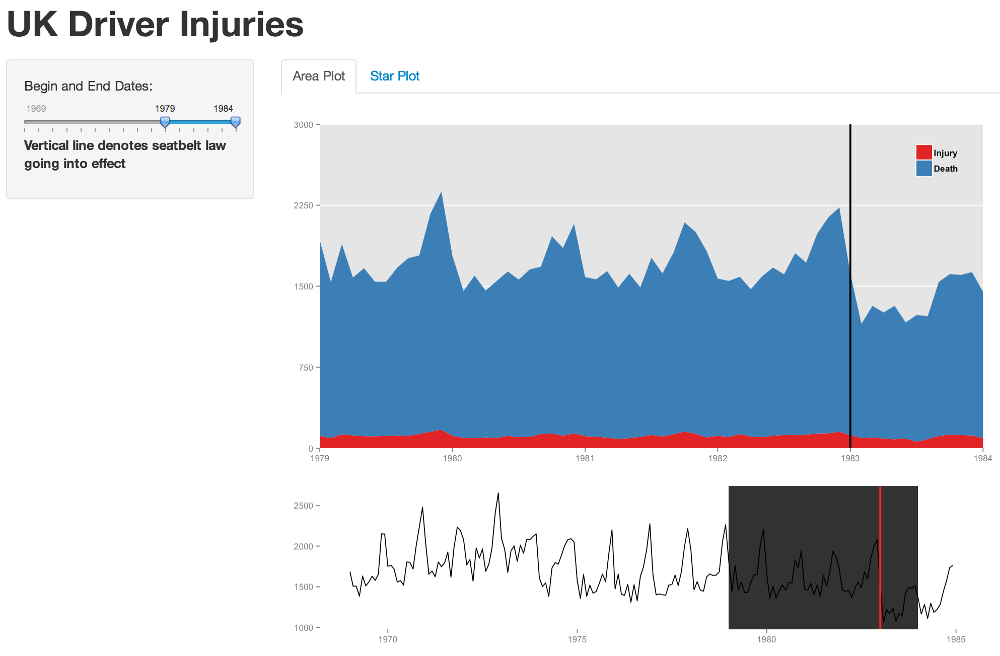
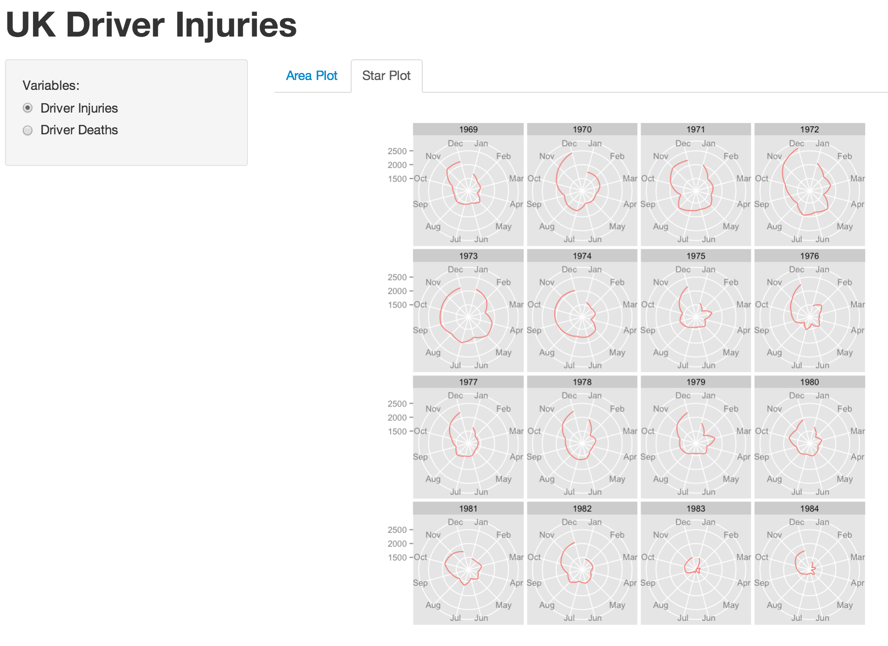

Homework 5: Time Series
==============================

| **Name**  | Ashley  |
|----------:|:-------------|
| **Email** | amcox@dons.usfca.edu |

## Instructions ##

The following packages must be installed prior to running this code:

- `ggplot2`
- `shiny`
- `scales`

To run this code, please enter the following commands in R:
```
library(shiny)
library(scales) 
library(ggplot2)
library(GGally)
shiny::runGitHub('msan622', 'ashleycoxley', subdir = 'homework5')
```

## Discussion ##

###Area Plot###

First, I chose a stacked area plot that visualizes driver injuries and deaths over time. I implemented a brushing technique similar to the one shown in the class demo. The user sees both an overview plot and a zoomed-in plot, and can choose the range of values to zoom in on. I implemented a double-sided slider for the date range choice. 

Aesthetically, I chose to remove y-axis lines, color with a bright blue/red combination, and format the legend. I added a vertical line denoting the date at which the seatbelt law went into effect. 

###Star Plot###

The star plots offer a different view into the same data. The user can choose to look at either driver injuries or driver deaths. This visualization is useful but might be better with straight lines connecting the points. I removed axis labels on this plot.
