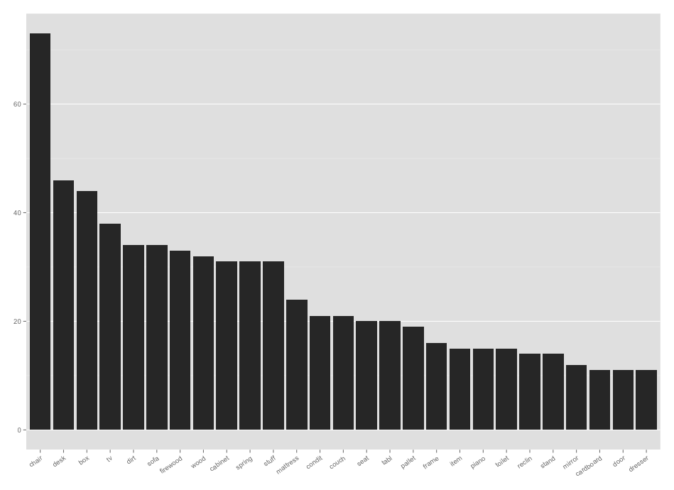
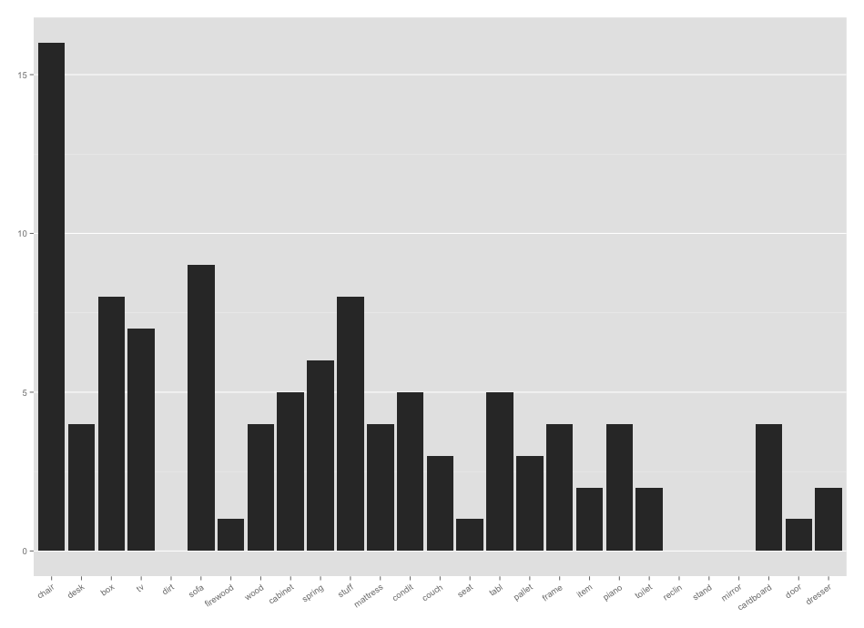
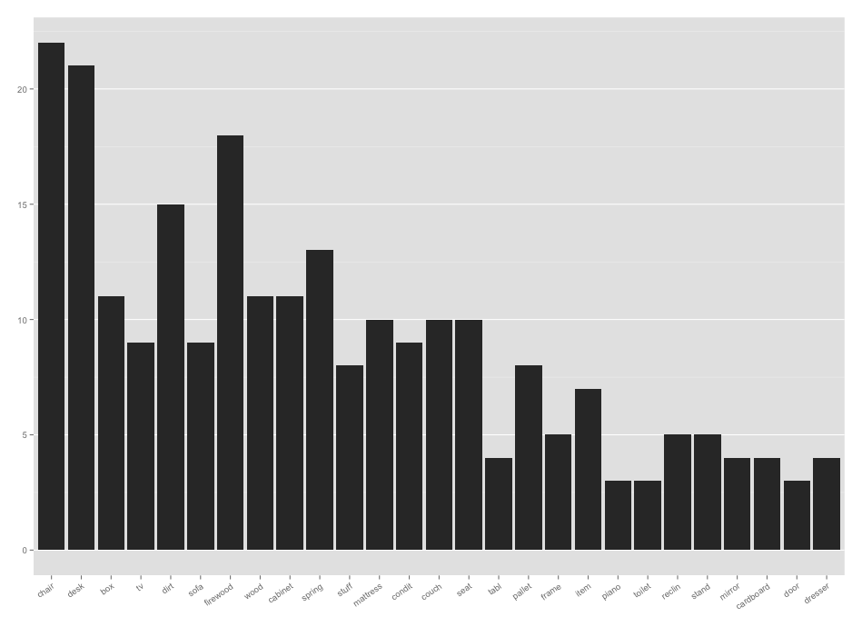

Project: Prototype
==============================

| **Name**  | Ashley Cox  |
|----------:|:-------------|
| **Email** | amcox@dons.usfca.edu |

## Discussion ##

For my project prototype, I'm showing a bar plot that shows the most frequent items listed on one day in the Bay Area craigslist Free section. The first plot shows the frequency for all regions:

The plot is interactive, so the user will select one or many regions to view. The x-axis will stay constant according to the order of the overall bar plot, but the bars will change. Below are two examples, of San Francisco and the East Bay.

