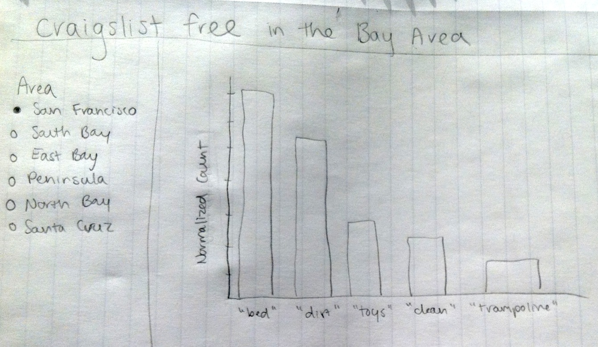

Project: Sketch
==============================

| **Name**  | Ashley Cox  |
|----------:|:-------------|
| **Email** | amcox@dons.usfca.edu |

### Planned Tools ###
I plan on using `R`, and in particular:
- `ggplot2`
- `shiny`
- `ggmaps`
- `rCharts` (possibly)

### Planned Techniques / Planned Interaction ###
I will visualize the craigslist free postings in four ways:
- as a word frequency histogram. This will give a good basic overview of the types of words that are common for each geographical area. Using `shiny`, I'll allow for switching among visualizations for each of the largest-grained geographical categories (San Francisco, South Bay, East Bay, Peninsula, North Bay, and Santa Cruz). 
- as a bubble plot. I plan to plot normalized posting volume (number of posts divided by number of residents) against average post length (in words) per neighborhood with the size of the bubble representing the population of the neighborhood. The bubbles will be colored by their broader geographical category. 
- as a map with the most common free item(s) for each category overlaid on a map of the Bay Area. I plan to use brushing by allowing the user to select a category to zoom into and visualize the most common items for each neighborgood within that category. The data used for this visualization will differ from that of the first plot in that it will consist in words used in the posting title only in an attempt to filter out the items themselves. I'll use a part of speech tagger to take only nouns and any adjectives that precede them. 
- as a stacked bar chart. For each category, I want to visualize the relative overall frequency of the words "dirty" and "clean", "old" and "new", and "working"/"works" and "broken." The user will be able to switch among the different word pairs to see the different relative frequencies. For this plot, I would like to have a way to visualize further by neighborhood, so I may also include the ability to select an area and see the breakdown by neighborhood. Given the limitations of `shiny`, a good way to distinguish the different levels of granularity might be the use of a different color scheme at the neighborhood level. I'll play around with this until I find a nice way to do it.

### Project Sketch ###

